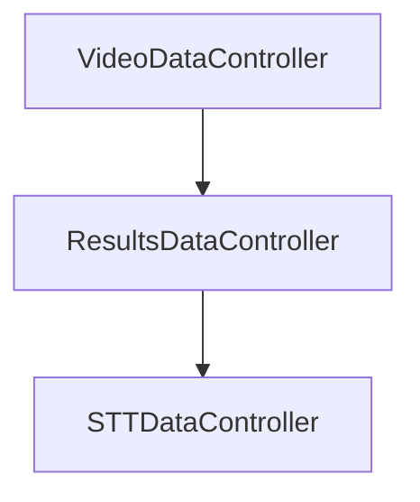
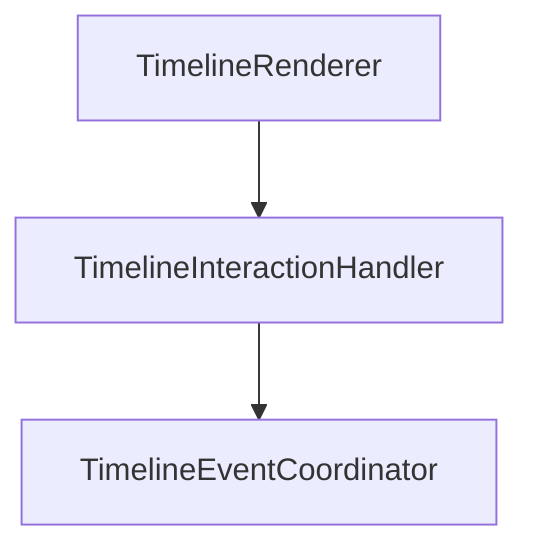
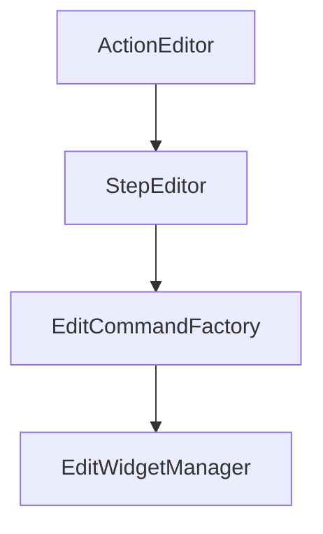
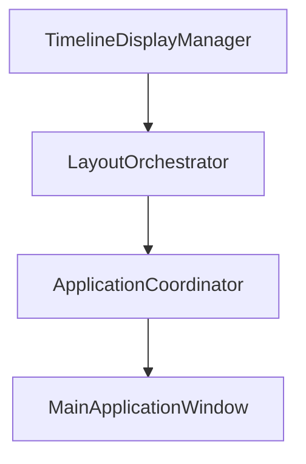

## 提案するクラス設計  

```mermaid  
classDiagram  
    %% メインアプリケーション層  
    class MainApplicationWindow {  
        +setup_ui()  
        +setup_connections()  
        +coordinate_components()  
    }  
      
    class ApplicationCoordinator {  
        +handle_video_events()  
        +handle_timeline_events()  
        +handle_edit_events()  
        +synchronize_components()  
    }  
      
    %% 編集システム層  
    class EditWidgetManager {  
        +create_edit_tabs()  
        +switch_tabs()  
        +coordinate_editors()  
    }  
      
    class ActionEditor {  
        +setup_action_ui()  
        +update_action_fields()  
        +apply_action_changes()  
        +validate_action_data()  
    }  
      
    class StepEditor {  
        +setup_step_ui()  
        +refresh_step_list()  
        +handle_step_selection()  
        +apply_step_changes()  
    }  
      
    class EditCommandFactory {  
        +create_interval_command()  
        +create_action_command()  
        +create_step_command()  
    }  
      
    %% タイムライン表示層  
    class TimelineDisplayManager {  
        +create_timeline_widgets()  
        +update_all_timelines()  
        +handle_timeline_events()  
    }  
      
    class TimelineRenderer {  
        +draw_background()  
        +draw_intervals()  
        +draw_playhead()  
        +draw_time_scale()  
    }  
      
    class TimelineInteractionHandler {  
        +handle_mouse_events()  
        +process_drag_operations()  
        +create_new_intervals()  
        +validate_interactions()  
    }  
      
    class TimelineEventCoordinator {  
        +emit_interval_clicked()  
        +emit_drag_events()  
        +emit_creation_events()  
    }  
      
    %% データ管理層  
    class VideoDataController {  
        +load_video()  
        +get_video_info()  
        +manage_playback()  
    }  
      
    class ResultsDataController {  
        +load_inference_results()  
        +filter_results()  
        +manage_query_results()  
    }  
      
    class STTDataController {  
        +manage_stt_dataset()  
        +handle_step_operations()  
        +export_dataset()  
    }  
      
    %% UI レイアウト層  
    class LayoutOrchestrator {  
        +create_main_layout()  
        +organize_panels()  
        +manage_splitters()  
    }  
      
    class ControlPanelBuilder {  
        +create_filter_controls()  
        +create_results_display()  
        +create_confidence_controls()  
    }  
      
    %% 関係性  
    MainApplicationWindow --> ApplicationCoordinator  
    MainApplicationWindow --> EditWidgetManager  
    MainApplicationWindow --> TimelineDisplayManager  
    MainApplicationWindow --> LayoutOrchestrator  
      
    ApplicationCoordinator --> VideoDataController  
    ApplicationCoordinator --> ResultsDataController  
    ApplicationCoordinator --> STTDataController  
      
    EditWidgetManager --> ActionEditor  
    EditWidgetManager --> StepEditor  
    EditWidgetManager --> EditCommandFactory  
      
    TimelineDisplayManager --> TimelineRenderer  
    TimelineDisplayManager --> TimelineInteractionHandler  
    TimelineDisplayManager --> TimelineEventCoordinator  
      
    LayoutOrchestrator --> ControlPanelBuilder  
```  
  

  
## 各クラスの担当機能  
  
### メインアプリケーション層  
  
**MainApplicationWindow** (目標: ~300行)  
- UIの初期化とメニュー設定のみに集中 [4](#0-3)   
- 各コーディネーターへの委譲  
  
**ApplicationCoordinator** (目標: ~400行)  
- コンポーネント間の調整とイベント処理 [5](#0-4)   
- シグナル・スロット接続の管理  
  
### 編集システム層  
  
**EditWidgetManager** (目標: ~200行)  
- タブウィジェットの管理と編集器の調整  
- 現在の`IntegratedEditWidget`の管理機能部分を分離  
  
**ActionEditor** (目標: ~300行)  
- アクション編集UIとロジック [6](#0-5)   
- 区間の時間編集とアクション詳細編集  
  
**StepEditor** (目標: ~250行)  
- ステップ編集UIとロジック [7](#0-6)   
- ステップリストの管理と編集  
  
**EditCommandFactory** (目標: ~150行)  
- コマンドオブジェクトの生成を一元化  
- Undo/Redo システムとの統合  
  
### タイムライン表示層  
  
**TimelineDisplayManager** (目標: ~200行)  
- 複数タイムラインの管理  
- 現在の`MultiTimelineViewer`の機能を継承  
  
**TimelineRenderer** (目標: ~300行)  
- タイムラインの描画処理のみに特化 [8](#0-7)   
- 背景、区間、プレイヘッド、時間スケールの描画  
  
**TimelineInteractionHandler** (目標: ~250行)  
- マウスイベントとドラッグ操作の処理  
- 現在の`TimelineViewer`のインタラクション部分を分離  
  
**TimelineEventCoordinator** (目標: ~100行)  
- タイムラインイベントの調整とシグナル発信  
  
### データ管理層  
  
**VideoDataController** (目標: ~150行)  
- 動画関連データの管理  
- 現在の`ApplicationController`の動画部分を分離  
  
**ResultsDataController** (目標: ~200行)  
- 推論結果の管理とフィルタリング  
- 現在の`ResultsManager`の機能を継承  
  
**STTDataController** (目標: ~200行)  
- STTデータセットの管理  
- 現在の`STTDataManager`の機能を継承  
  
### UI レイアウト層  
  
**LayoutOrchestrator** (目標: ~200行)  
- メインレイアウトの構築  
- 現在の`UILayoutManager`の機能を継承  
  
**ControlPanelBuilder** (目標: ~150行)  
- 右パネルのコントロール要素構築  
  
## 推奨アプローチ：ボトムアップ実装  
  
### 理由  
  
1. **依存関係の明確化**: 末端クラスは他のクラスに依存されるが、他に依存しない独立性が高い  
2. **テスト容易性**: 小さな単位から段階的にテストできる  
3. **既存コードの活用**: 現在のデータ構造やUI要素を段階的に移行できる  
  
### 実装順序の提案  
  
#### Phase 1: データ層の基盤クラス（1-2週間）  

  
**VideoDataController**から開始する理由：  
- 現在の`ApplicationController` [1](#1-0) の動画関連機能を分離  
- 他のデータコントローラーの基盤となる  
- 比較的独立性が高い  
  
#### Phase 2: UI描画・インタラクション層（2-3週間）  

  
**TimelineRenderer**から開始：  
- 現在の`TimelineViewer` [2](#1-1) の描画処理を分離  
- 描画ロジックは比較的独立している  
  
#### Phase 3: 編集システム層（2-3週間）  

  
**ActionEditor**から開始：  
- 現在の`IntegratedEditWidget` [3](#1-2) のアクション編集部分を分離  
- ステップ編集より単純な構造  
  
#### Phase 4: 統合・調整層（1-2週間）  

  
