# old class diaglam

## abstract

moment_detrの推論結果JSONファイルを読み込んで動画の検出区間を確認できるViewerアプリケーションのクラス図です。実装に基づいて設計されています。

## src
この設計に基づいた実装は[old](../old/)ディレクトリにあります。

## クラス図

```mermaid
classDiagram
    class MainApplicationWindow {
        +video_controller: VideoPlayerController
        +results_manager: ResultsManager
        +file_manager: FileManager
        +ui_layout_manager: UILayoutManager
        +app_controller: ApplicationController
        +filter_controller: FilterController
        +stt_data_manager: STTDataManager
        +hand_type_filter_manager: HandTypeFilterManager
        +integrated_edit_widget: IntegratedEditWidget
        +multi_timeline_viewer: MultiTimelineViewer
        +confidence_slider: QSlider
        +confidence_value_label: QLabel
        +setup_ui()
        +setup_connections()
        +setup_menus()
        +create_left_panel()
        +create_right_panel()
        +setup_controller_ui_components()
        +load_video_from_path()
        +load_inference_results_from_path()
        +save_results()
        +export_stt_dataset()
        +on_video_position_changed()
        +on_video_duration_changed()
        +on_hand_type_filter_changed()
        +on_interval_selected()
        +on_results_updated()
        +on_timeline_interval_clicked()
        +update_confidence_filter()
        +apply_filters()
        +update_display()
    }

    class ApplicationController {
        +video_info: VideoInfo
        +inference_results: InferenceResults
        +current_query_results: QueryResults
        +loader: InferenceResultsLoader
        +saver: InferenceResultsSaver
        +saliency_filter: SaliencyFilter
        +load_video()
        +load_inference_results()
        +get_results_for_current_video()
        +apply_saliency_filter()
    }

    class IntervalModificationController {
        +app_controller: ApplicationController
        +modify_interval()
        ~intervalChanged: pyqtSignal
    }

    class FilterController {
        +app_controller: ApplicationController
        +confidence_threshold: float
        +saliency_threshold: float
        +set_confidence_threshold()
        +set_saliency_threshold()
        ~filtersChanged: pyqtSignal
    }

    class VideoPlayerController {
        +video_player: QMediaPlayer
        +video_widget: QVideoWidget
        +play_button: QPushButton
        +position_slider: QSlider
        +time_label: QLabel
        +current_video_path: str
        +setup_player()
        +setup_connections()
        +get_video_widget()
        +get_controls_layout()
        +load_video()
        +toggle_playback()
        +update_position()
        +update_duration()
        +set_position()
        +seek_to_time()
        +get_duration_seconds()
        +get_position_seconds()
        +update_time_label()
        ~positionChanged: pyqtSignal
        ~durationChanged: pyqtSignal
    }

    class ResultsManager {
        +all_results: List[QueryResults]
        +filtered_results: List[QueryResults]
        +confidence_threshold: float
        +inference_loader: InferenceResultsLoader
        +inference_saver: InferenceResultsSaver
        +_hand_type_combo_widget: QComboBox
        +_results_list_widget: QListWidget
        +set_ui_components()
        +load_inference_results()
        +update_filtered_results()
        +update_results_display()
        +_group_results_by_hand_type()
        +on_result_item_clicked()
        +set_confidence_threshold()
        +get_all_results()
        +get_filtered_results()
        +save_results()
        ~intervalSelected: pyqtSignal
        ~resultsUpdated: pyqtSignal
    }

    class FileManager {
        +open_video_dialog()
        +load_inference_results_dialog()
        +save_results_dialog()
        +validate_video_file()
        +validate_json_file()
        +show_save_success_message()
        +show_save_error_message()
        +show_load_error_message()
        +show_no_results_warning()
        ~videoLoaded: pyqtSignal
        ~resultsLoaded: pyqtSignal
        ~resultsSaved: pyqtSignal
    }

    class UILayoutManager {
        +ui_components: dict
        +hand_type_filter_manager: HandTypeFilterManager
        +integrated_edit_widget: IntegratedEditWidget
        +create_main_layout()
        +create_left_panel()
        +create_right_panel()
        +create_hand_type_filter_group()
        +create_detection_results_group()
        +create_confidence_filter_group()
    }

    class HandTypeFilterManager {
        +current_filter: str
        +all_results: List[QueryResults]
        +set_results()
        +set_filter()
        +get_filtered_results()
        +get_grouped_results()
        ~filterChanged: pyqtSignal
    }

    class IntegratedEditWidget {
        +current_query_result: QueryResults
        +selected_interval: DetectionInterval
        +selected_interval_index: int
        +stt_data_manager: STTDataManager
        +current_video_name: str
        +tab_widget: QTabWidget
        +action_tab: QWidget
        +step_tab: QWidget
        +start_spinbox: QDoubleSpinBox
        +end_spinbox: QDoubleSpinBox
        +confidence_label: QLabel
        +hand_combo: QComboBox
        +action_verb_edit: QLineEdit
        +manipulated_object_edit: QLineEdit
        +target_object_edit: QLineEdit
        +tool_edit: QLineEdit
        +step_list: QListWidget
        +step_text_edit: QLineEdit
        +step_edit_text: QLineEdit
        +step_start_spin: QDoubleSpinBox
        +step_end_spin: QDoubleSpinBox
        +setup_ui()
        +create_action_edit_tab()
        +create_step_edit_tab()
        +set_stt_data_manager()
        +set_current_video()
        +set_current_query_results()
        +set_selected_interval()
        +clear_selection()
        +update_interval_ui()
        +apply_interval_changes()
        +delete_interval()
        +add_new_interval()
        +refresh_step_list()
        +on_step_selected()
        +add_step()
        +apply_step_changes()
        +delete_step()
        ~dataChanged: pyqtSignal
        ~intervalUpdated: pyqtSignal
        ~intervalDeleted: pyqtSignal
        ~intervalAdded: pyqtSignal
    }

    class STTDataManager {
        +stt_dataset: STTDataset
        +action_id_counter: int
        +step_id_counter: int
        +add_video_data()
        +add_inference_results()
        +add_step()
        +_get_or_create_action_category()
        +_get_or_create_step_category()
        +update_video_subset()
        +export_to_json()
    }

    class STTExportDialog {
        +video_names: List[str]
        +subset_settings: dict
        +subset_combos: dict
        +ok_button: QPushButton
        +cancel_button: QPushButton
        +setup_ui()
        +get_subset_settings()
    }

    class MultiTimelineViewer {
        +timeline_widgets: List[QWidget]
        +scroll_area: QScrollArea
        +content_widget: QWidget
        +layout: QVBoxLayout
        +video_duration: float
        +set_query_results()
        +create_hand_type_timeline()
        +on_interval_clicked_with_embedded_query()
        +clear_timelines()
        +set_video_duration()
        +update_playhead_position()
        ~intervalClicked: pyqtSignal
    }

    class TimelineViewer {
        +video_duration: float
        +current_position: float
        +intervals: List[DetectionInterval]
        +saliency_scores: List[float]
        +time_scale_enabled: bool
        +clip_duration: float
        +set_video_duration()
        +set_intervals()
        +set_saliency_scores()
        +paintEvent()
        +draw_saliency_heatmap()
        +draw_interval()
        +draw_current_position()
        +draw_time_scale()
        +calculate_scale_interval()
        +enable_time_scale()
        +update_playhead_position()
        +mousePressEvent()
        ~intervalClicked: pyqtSignal
        ~timePositionChanged: pyqtSignal
    }

    class QueryResults {
        +query_text: str
        +video_id: str
        +relevant_windows: List[DetectionInterval]
        +saliency_scores: List[float]
        +query_id: Optional[int]
        +from_moment_detr_json()
    }

    class DetectionInterval {
        +start_time: float
        +end_time: float
        +confidence_score: float
        +query_id: Optional[int]
        +label: Optional[str]
        +query_result: Optional[object]
        +duration: property
        +overlaps_with()
        +__eq__()
        +__hash__()
    }

    class InferenceResults {
        +results: List[QueryResults]
        +timestamp: datetime
        +model_info: dict
        +video_path: Optional[str]
        +total_queries: Optional[int]
        +get_results_for_video()
    }

    class InferenceResultsLoader {
        +load_from_json()
    }

    class InferenceResultsSaver {
        +save_to_json()
    }

    class SaliencyFilter {
        +threshold: float
        +filter_by_saliency()
        +get_salient_intervals()
        +apply_temporal_smoothing()
    }

    class VideoInfo {
        +video_id: str
        +file_path: str
        +duration: float
        +fps: float
        +width: int
        +height: int
        +clip_duration: float
        +total_clips: property
    }

    class ActionData {
        +action_verb: str
        +manipulated_object: Optional[str]
        +target_object: Optional[str]
        +tool: Optional[str]
    }

    class ActionEntry {
        +action: ActionData
        +ids: List[int]
        +id: int
        +segment: List[float]
        +segment_frames: List[int]
    }

    class StepEntry {
        +step: str
        +id: int
        +segment: List[float]
        +segment_frames: List[int]
    }

    class VideoData {
        +subset: str
        +duration: float
        +fps: float
        +actions: Dict[str, List[ActionEntry]]
        +steps: List[StepEntry]
    }

    class ActionCategory {
        +id: int
        +interaction: str
    }

    class StepCategory {
        +id: int
        +step: str
    }

    class STTDataset {
        +info: Dict[str, Any]
        +database: Dict[str, VideoData]
        +action_categories: List[ActionCategory]
        +step_categories: List[StepCategory]
    }

    class QueryParser {
        +VALID_HAND_TYPES: Set[str]
        +validate_and_parse_query()
        +detect_hand_type()
    }

    class QueryValidationError {
        <<Exception>>
    }

    %% 関係性
    MainApplicationWindow --> VideoPlayerController
    MainApplicationWindow --> ResultsManager
    MainApplicationWindow --> FileManager
    MainApplicationWindow --> UILayoutManager
    MainApplicationWindow --> ApplicationController
    MainApplicationWindow --> FilterController
    MainApplicationWindow --> STTDataManager
    MainApplicationWindow --> HandTypeFilterManager
    MainApplicationWindow --> IntegratedEditWidget
    MainApplicationWindow --> MultiTimelineViewer

    UILayoutManager --> HandTypeFilterManager
    UILayoutManager --> IntegratedEditWidget

    ApplicationController --> VideoInfo
    ApplicationController --> InferenceResults
    ApplicationController --> InferenceResultsLoader
    ApplicationController --> InferenceResultsSaver
    ApplicationController --> SaliencyFilter

    IntervalModificationController --> ApplicationController
    IntervalModificationController --> DetectionInterval

    FilterController --> ApplicationController

    ResultsManager --> InferenceResultsLoader
    ResultsManager --> InferenceResultsSaver
    ResultsManager --> QueryParser

    HandTypeFilterManager --> QueryResults
    HandTypeFilterManager --> QueryParser
    HandTypeFilterManager --> QueryValidationError

    IntegratedEditWidget --> QueryResults
    IntegratedEditWidget --> DetectionInterval
    IntegratedEditWidget --> STTDataManager
    IntegratedEditWidget --> ActionEntry
    IntegratedEditWidget --> StepEntry
    IntegratedEditWidget --> QueryParser

    STTDataManager --> STTDataset
    STTDataManager --> VideoInfo
    STTDataManager --> QueryResults
    STTDataManager --> ActionEntry
    STTDataManager --> StepEntry
    STTDataManager --> ActionCategory
    STTDataManager --> StepCategory
    STTDataManager --> QueryParser
    STTDataManager --> QueryValidationError

    STTExportDialog --> STTDataManager

    MultiTimelineViewer --> TimelineViewer
    MultiTimelineViewer --> QueryParser
    MultiTimelineViewer --> QueryValidationError

    TimelineViewer --> DetectionInterval

    InferenceResults --> QueryResults
    QueryResults --> DetectionInterval

    STTDataset --> VideoData
    STTDataset --> ActionCategory
    STTDataset --> StepCategory

    VideoData --> ActionEntry
    VideoData --> StepEntry

    ActionEntry --> ActionData
```

## 主要な設計決定

このクラス図は、実際に実装されたコードに基づいて作成されています。moment_detrの推論結果構造に対応し、PyQt6を使用したGUIアプリケーションとして設計されています。

### コアデータモデル

**DetectionInterval**は、`@dataclass`として実装され、開始/終了時刻、信頼度スコア、クエリIDを持つ個別の検出区間を表現します。実際のmoment_detr出力の`pred_relevant_windows`フォーマット`[開始時刻（秒）, 終了時刻（秒）, 信頼度スコア]`に対応しています。

**QueryResults**は単一クエリの結果をカプセル化し、複数の検出区間と関連する`pred_saliency_scores`配列を含みます。`from_moment_detr_json`クラスメソッドでJSONからの変換を行います。

**InferenceResults**は複数のクエリ結果を管理し、動画パス、タイムスタンプ、モデル情報なども保持します。

### UI制御レイヤー

**VideoPlayerController**はQMediaPlayerとQVideoWidgetを使用した動画再生制御を担当し、PyQt6のシグナル・スロット機構でイベント通知を行います。

**MultiTimelineViewer**は複数のクエリ結果を同時に表示するタイムライン表示を提供し、個々の**TimelineViewer**を組み合わせて実装されています。

**ResultsManager**は推論結果の読み込み、表示、管理を統合的に行い、UIコンポーネントとの連携を担当します。

### データ管理レイヤー

**InferenceResultsLoader**と**InferenceResultsSaver**は、JSONおよびJSONL形式でのファイル入出力を処理します。moment_detrの出力形式とアプリケーション内部形式の変換を担当します。

### フィルタリングシステム

**SaliencyFilter**は`pred_saliency_scores`を使用した閾値ベースのフィルタリングを実装し、時間的平滑化機能も提供します。

**FilterController**は信頼度とSaliency閾値の制御を統合し、**ApplicationController**と連携してフィルタリング処理を管理します。

### アーキテクチャパターン

この設計はMVC（Model-View-Controller）パターンとPyQt6のシグナル・スロット機構を組み合わせ、以下の特徴を持ちます：

- **MainApplicationWindow**がメインコントローラーとして各種サブコントローラーを統制
- **UILayoutManager**によるレイアウト管理の分離
- **FileManager**による一元的なファイル操作管理
- シグナル・スロットによる疎結合な部品間通信

この設計により、動画アノテーションワークフローのための保守可能で拡張可能なアプリケーションを実現しています。

## 実装状況

### 実装済みクラス
- DetectionInterval（データクラス）
- QueryResults、InferenceResults（データクラス）
- VideoInfo（データクラス）
- InferenceResultsLoader、InferenceResultsSaver（データ処理）
- SaliencyFilter（フィルタリング）
- VideoPlayerController（動画制御）
- TimelineViewer、MultiTimelineViewer（タイムライン表示）
- ResultsManager（結果管理）
- IntervalEditController（区間編集）
- FileManager（ファイル操作）
- UILayoutManager（レイアウト管理）
- ApplicationController（アプリケーション制御）
- FilterController（フィルタ制御）
- MainApplicationWindow（メインウィンドウ）

### 廃止されたクラス（設計から削除）
- VideoPlayer（VideoPlayerControllerに統合）
- IntervalEditor（IntervalEditControllerに統合）
- SaliencyThresholdController（MainApplicationWindowに統合）
- IntervalModificationController（実装不要と判断）

## Notes

この実装は、実際のコードベースに基づいて設計されており、PyQt6のGUIフレームワークを活用しています。moment_detrのJSON出力形式（`pred_relevant_windows`と`pred_saliency_scores`）に対応し、動画ファイルごとの複数クエリ結果をサポートします。

シグナル・スロット機構により、各コンポーネント間の疎結合を実現し、区間編集、フィルタリング、動画再生の連携を効率的に行います。データの整合性を保ちながら、ユーザーが動的に閾値を調整できる仕組みを提供しています。